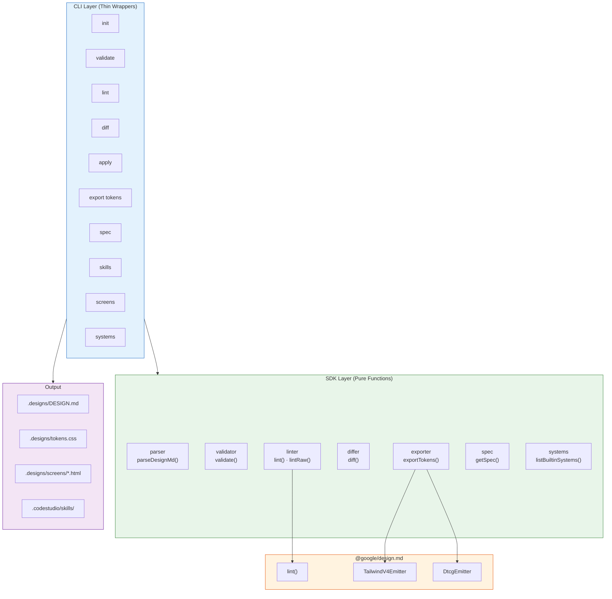
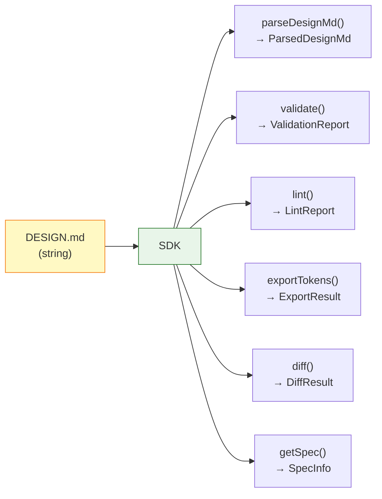
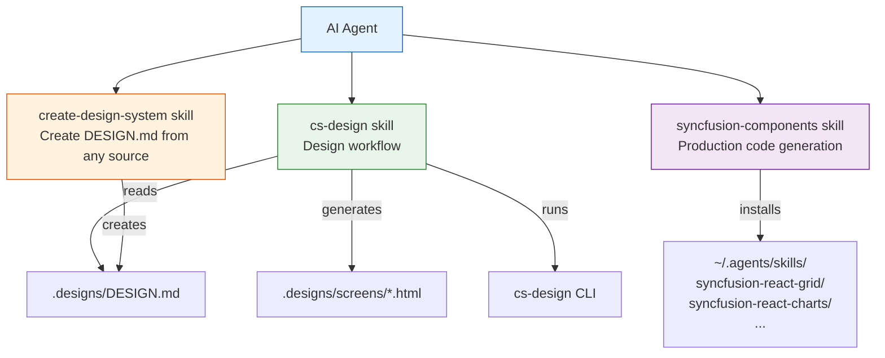

# cs-design

> CLI + SDK for design system context for AI coding agents.

**The agent designs. The CLI manages the files. The SDK powers everything.**

`cs-design` scaffolds and manages design system files for AI-powered UI design workflows. It provides the structured context (DESIGN.md, tokens, agent skills) that AI agents read to produce consistent, brand-aligned UI screens — then convert them to production code with Syncfusion components.

## Architecture



### Three-Layer Design

```
@syncfusion/cs-design
├── src/sdk/          ← Pure functions (no I/O, no process.exit, no chalk)
│   │                    Every function returns Result<T>, never throws
│   ├── parser.ts     ← parseDesignMd(), isValidHexColor()
│   ├── validator.ts  ← validate() → ValidationReport
│   ├── linter.ts     ← lint(), lintRaw() → wraps @google/design.md
│   ├── differ.ts     ← diff() → DiffResult
│   ├── exporter.ts   ← exportTokens() → 5 formats (css, tailwind, json, css-tailwind, dtcg)
│   ├── spec.ts       ← getSpec() → format spec + lint rules
│   ├── systems.ts    ← listBuiltinSystems(), getBuiltinSystemContent()
│   └── types.ts      ← All shared types
├── src/commands/     ← Thin CLI wrappers (read file → call SDK → format → exit)
├── src/cli.ts        ← Commander setup
└── src/index.ts      ← Re-exports SDK + file-system utilities
```

| Entry Point | Import Path | Size | Purpose |
|-------------|-------------|------|---------|
| SDK | `@syncfusion/cs-design/sdk` | 34 KB | Pure functions — for extensions, MCP servers, CI/CD |
| Library | `@syncfusion/cs-design` | 39 KB | SDK + file-system utilities |
| CLI | `cs-design` | 106 KB | Command-line interface |

---

## Install

```bash
npm install -g @syncfusion/cs-design    # Global CLI
npm install @syncfusion/cs-design       # SDK dependency
```

## Quick Start

```bash
# 1. Initialize a project
cs-design init "My App"

# 2. Validate and lint
cs-design validate
cs-design lint

# 3. Export tokens
cs-design export tokens --format css

# 4. Apply changes (re-exports tokens.css, screens auto-update)
cs-design apply

# 5. Install Syncfusion component skills
cs-design skills add react
```

---

## CLI Reference

### Project & Validation

| Command | Description |
|---------|-------------|
| `cs-design init <name> [--system <id>] [--force]` | Initialize a new design project |
| `cs-design validate` | Structural validation + deep lint (combined) |
| `cs-design lint [file] [--json]` | Deep lint — WCAG contrast, broken refs, orphaned tokens |
| `cs-design diff <before> <after> [--json]` | Compare two DESIGN.md files for token-level regressions |
| `cs-design spec [--rules] [--rules-only] [--format json]` | Output the DESIGN.md format specification |
| `cs-design apply` | Re-export tokens.css — all screens update automatically |

### Token Export

| Command | Format |
|---------|--------|
| `cs-design export tokens --format css` | CSS custom properties (`:root { --color-primary: ... }`) |
| `cs-design export tokens --format tailwind` | Tailwind v3 `theme.extend` config object |
| `cs-design export tokens --format css-tailwind` | Tailwind v4 CSS `@theme { ... }` block |
| `cs-design export tokens --format json` | Flat JSON key-value pairs |
| `cs-design export tokens --format dtcg` | W3C Design Tokens (DTCG) format |
| `cs-design export tokens --format css --out <path>` | Export to custom file path |

### Screens & Systems

| Command | Description |
|---------|-------------|
| `cs-design screens list [--json]` | List all screens in the project |
| `cs-design systems list` | List available design systems (built-in + installed) |
| `cs-design systems install <source>` | Install from GitHub (`github:user/repo`) or local path |
| `cs-design systems create <name>` | Scaffold a new empty design system |

### Syncfusion Component Skills

| Command | Description |
|---------|-------------|
| `cs-design skills add <framework>` | Install all Syncfusion component skills |
| `cs-design skills add <framework> --only grid,charts` | Install specific components only |
| `cs-design skills list [--json]` | List installed Syncfusion skills |
| `cs-design skills remove <framework>` | Remove skills for a framework |

**Supported frameworks:** `react` · `angular` · `blazor` · `vue` · `javascript` · `maui` · `wpf` · `winui` · `winforms`

---

## Deep Linting (powered by @google/design.md)

`cs-design` integrates the [`@google/design.md`](https://github.com/google-labs-code/design.md) linter for spec-compliant validation — 9 lint rules maintained by Google's team:

| Rule | Severity | What it catches |
|------|----------|-----------------|
| `broken-ref` | error | Token references (`{colors.primary}`) that don't resolve |
| `missing-primary` | warning | No primary color defined |
| `contrast-ratio` | warning | WCAG AA contrast failures (4.5:1 minimum) |
| `orphaned-tokens` | warning | Color tokens never referenced by components |
| `missing-typography` | warning | Colors defined but no typography tokens |
| `section-order` | warning | Sections out of canonical order |
| `unknown-key` | warning | YAML key typos (e.g., `colours:` → `colors:`) |
| `token-like-ignored` | warning | Frontmatter keys silently dropped |
| `missing-sections` | info | Recommended sections absent |

```bash
cs-design lint                    # Pretty output
cs-design lint --json             # Machine-readable (CI/CD)
cs-design lint path/to/DESIGN.md  # Lint a specific file
cs-design diff old.md new.md      # Compare two versions
```

---

## SDK (Programmatic API)

The SDK provides **pure functions** with no side effects — no `process.exit()`, no `console.log()`, no file I/O. Every function returns `Result<T>`.



### Import

```ts
// Pure SDK — recommended for embedding (no chalk, no ora, no fs)
import { parseDesignMd, validate, lint, diff, exportTokens } from "@syncfusion/cs-design/sdk";

// Full library — SDK + file-system utilities
import { parseDesignMd, validate, lint, readDesignMd } from "@syncfusion/cs-design";
```

### Result Type

All SDK functions return `Result<T>` — they never throw:

```ts
type Result<T> = { ok: true; data: T } | { ok: false; error: string };
```

### API Reference

| Function | Input | Output | Description |
|----------|-------|--------|-------------|
| `parseDesignMd(content)` | `string` | `Result<ParsedDesignMd>` | Parse YAML front matter + markdown body |
| `validate(content)` | `string` | `Result<ValidationReport>` | Structural validation (name, colors, typography, sections) |
| `lint(content)` | `string` | `Result<LintReport>` | Deep lint — WCAG contrast, broken refs, orphaned tokens |
| `lintRaw(content)` | `string` | `Result<GoogleLintReport>` | Raw Google report with full DesignSystemState |
| `diff(before, after)` | `string, string` | `Result<DiffResult>` | Token-level diff with regression detection |
| `exportTokens(content, format)` | `string, TokenFormat` | `Result<ExportResult>` | Export to any of 5 formats |
| `generateCss(yaml)` | `DesignYaml` | `string` | CSS custom properties |
| `generateTailwind(yaml)` | `DesignYaml` | `string` | Tailwind v3 theme config |
| `generateJson(yaml)` | `DesignYaml` | `string` | Flat JSON tokens |
| `generateCssTailwind(content)` | `string` | `Result<string>` | Tailwind v4 CSS @theme |
| `generateDtcg(content)` | `string` | `Result<string>` | W3C DTCG tokens.json |
| `getSpec()` | — | `SpecInfo` | Format spec + lint rules |
| `listBuiltinSystems()` | — | `DesignSystemMeta[]` | Built-in system metadata |
| `getBuiltinSystemContent(id)` | `string` | `string \| null` | Full DESIGN.md content |

### Examples

```ts
import { parseDesignMd, validate, lint, diff, exportTokens, getSpec } from "@syncfusion/cs-design/sdk";
import fs from "fs";

// ── Parse ──
const parsed = parseDesignMd(fs.readFileSync("DESIGN.md", "utf-8"));
if (parsed.ok) {
  console.log(parsed.data.yaml.name);           // "Modern Minimal"
  console.log(parsed.data.yaml.colors.primary);  // "#1A1C1E"
}

// ── Validate ──
const validation = validate(content);
if (validation.ok && !validation.data.valid) {
  for (const f of validation.data.findings.filter(f => !f.passed)) {
    console.log(`[${f.severity}] ${f.check}: ${f.message}`);
  }
}

// ── Lint ──
const lintResult = lint(content);
if (lintResult.ok) {
  console.log(lintResult.data.summary);  // { errors: 0, warnings: 4, infos: 1 }
  for (const f of lintResult.data.findings) {
    console.log(`[${f.severity}] ${f.message}`);
  }
}

// ── Export ──
const css = exportTokens(content, "css");
if (css.ok) fs.writeFileSync("tokens.css", css.data.content);

const dtcg = exportTokens(content, "dtcg");
if (dtcg.ok) fs.writeFileSync("tokens.json", dtcg.data.content);

// ── Diff ──
const diffResult = diff(oldContent, newContent);
if (diffResult.ok) {
  console.log(diffResult.data.tokens.colors.modified);  // ["primary", "accent"]
  console.log(diffResult.data.regression);               // true/false
}

// ── Spec (for agent prompts) ──
const spec = getSpec();
const prompt = `Follow this spec: sections must be ${spec.format.sectionOrder.join(" → ")}`;
```

### Use Cases

| Use Case | Import | Why |
|----------|--------|-----|
| Code Studio extension | `@syncfusion/cs-design/sdk` | Pure functions, no side effects |
| MCP server | `@syncfusion/cs-design/sdk` | Returns data, never exits |
| CI/CD pipeline | `@syncfusion/cs-design/sdk` | JSON-serializable results |
| Web application | `@syncfusion/cs-design/sdk` | No Node.js fs dependency |
| Node.js script with file I/O | `@syncfusion/cs-design` | Includes readDesignMd(), requireProject() |

---

## Agent Skills

`cs-design init` installs three [Agent Skills](https://code.visualstudio.com/docs/agent-customization/agent-skills) — portable instructions that work with any skills-compatible AI agent (Code Studio, VS Code Copilot, Claude, Cursor, etc.).



| Skill | Purpose |
|-------|---------|
| **cs-design** | Design workflow — read tokens, generate screens, validate, lint, diff, export, apply |
| **create-design-system** | Create DESIGN.md from any source — images, CSS, HTML, URLs, text descriptions |
| **syncfusion-components** | Install and use Syncfusion component skills for production code generation |

### Workflow

1. **Agent reads `cs-design` skill** → knows how to generate HTML screens using design tokens, validate with `cs-design validate`, lint with `cs-design lint`, and export tokens in 5 formats
2. **Agent reads `create-design-system` skill** → can create a DESIGN.md from a screenshot, CSS file, URL, or text description, then validate and lint it
3. **Agent reads `syncfusion-components` skill** → runs `cs-design skills add react` to install component skills, then generates production Syncfusion code

### CSS Variables & Apply

Screens use CSS custom properties (`var(--color-accent)`) instead of hardcoded hex values:

```bash
# Edit DESIGN.md (change accent color, fonts, etc.)
# Then apply to all screens:
cs-design apply
```

All screens update automatically because they reference CSS variables, not hardcoded values.

---

## Built-in Design Systems

| ID | Name | Best for |
|----|------|----------|
| `modern-minimal` | Modern Minimal | SaaS, dashboards, utility pages |
| `corporate-clean` | Corporate Clean | Enterprise, B2B platforms |
| `bold-creative` | Bold Creative | Marketing, portfolios, creative agencies |

```bash
cs-design init "My App" --system bold-creative
cs-design systems list
cs-design systems install github:user/repo
cs-design systems create "My Brand"
```

---

## DESIGN.md Format

Uses the [**Stitch DESIGN.md specification**](https://github.com/google-labs-code/design.md) — YAML front matter for machine-readable tokens, markdown body for human-readable rationale.

```yaml
---
version: alpha
name: "My System"
colors:
  primary: "#1A1C1E"
  accent: "#2563EB"
  background: "#FFFFFF"
typography:
  h1:
    fontFamily: "Inter"
    fontSize: "48px"
    fontWeight: 700
    lineHeight: 1.1
  body:
    fontFamily: "Inter"
    fontSize: "16px"
    fontWeight: 400
    lineHeight: 1.6
rounded:
  sm: "4px"
  md: "8px"
  lg: "12px"
spacing:
  sm: "8px"
  md: "16px"
  lg: "24px"
components:
  button:
    backgroundColor: "{colors.accent}"
    textColor: "{colors.background}"
    rounded: "{rounded.md}"
    padding: "12px 24px"
---

# My System

## Overview
Brand personality, mood, visual style...

## Colors
Palette description and usage rules...

## Typography
Type system and hierarchy...

## Components
Button, card, input styles...

## Do's and Don'ts
Explicit design rules...
```

---

## Project Structure

```
my-project/
├── .codestudio/skills/
│   ├── cs-design/SKILL.md              ← Design workflow skill
│   ├── syncfusion-components/SKILL.md  ← Component skill router
│   └── create-design-system/SKILL.md   ← Design system creator
├── .designs/
│   ├── DESIGN.md                       ← Design system (tokens + prose)
│   ├── project.json                    ← Project metadata + screen registry
│   ├── tokens.css                      ← Exported CSS custom properties
│   └── screens/
│       ├── landing-page.html           ← Generated by agent
│       ├── dashboard.html              ← Generated by agent
│       └── settings.html               ← Generated by agent
└── (your existing project files)
```

## Environment Variables

| Variable | Description |
|----------|-------------|
| `CS_DESIGN_HOME` | Override global config directory (default: `~/.cs-design/`) |

## License

MIT
