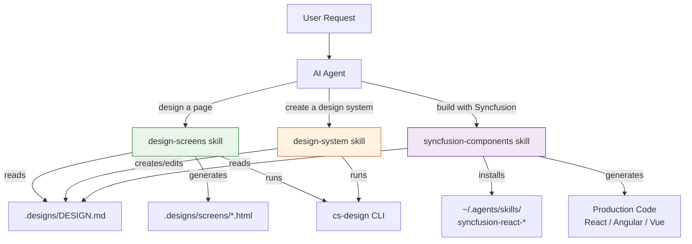

# Agent Skills Guide

`cs-design` ships as the **`syncfusion-ui-designer`** agent plugin — a bundle of three skills that teach AI coding agents how to work with your design system. Skills are the bridge between your design tokens and the AI agent's output.

---

## What Are Agent Skills?

Agent Skills are `.md` files bundled inside **agent plugins** that AI agents automatically discover and read. They follow the [Agent Skills open standard](https://code.visualstudio.com/docs/agent-customization/agent-skills) and work with:

- **Code Studio** (Syncfusion)
- **VS Code Copilot** (GitHub)
- **Cursor**
- **Claude** (Anthropic)
- **Any skills-compatible AI agent**

Each skill has:
- **YAML frontmatter** — `name`, `description`, `argument-hint` (tells the agent when to activate)
- **Markdown body** — Step-by-step instructions the agent follows

---

## Plugin Architecture

Skills are **not** generated per-project. They ship as static files inside the `syncfusion-ui-designer` plugin:

```
plugin/
├── plugin.json                          ← Plugin manifest
└── skills/
    ├── design-screens/SKILL.md          ← Generate HTML screens from DESIGN.md
    ├── design-system/SKILL.md           ← Create or edit DESIGN.md
    └── syncfusion-components/SKILL.md   ← Production code with Syncfusion
```

The plugin is installed once — all projects benefit automatically. No files are written into your project's `.codestudio/skills/` folder.

### Installing the Plugin

**Local testing:**

Add the plugin path to Code Studio settings:

```json
"chat.pluginLocations": [
  "/path/to/syncfusion-ui-designer/plugin"
]
```

**Public distribution:**

The plugin will be available via the [awesome-copilot](https://github.com/github/awesome-copilot) registry or npm (`@syncfusion/ui-designer-plugin`).

---

## The Three Skills



---

## Skill 1: `design-screens` — Design Workflow

**Location:** `plugin/skills/design-screens/SKILL.md` (shipped with the plugin)

### When the Agent Uses This Skill

The agent activates this skill when the user asks to:

| User says... | Agent does... |
|-------------|--------------|
| "Design a pricing page" | Reads DESIGN.md → generates HTML screen |
| "Create a dashboard" | Reads tokens → generates responsive HTML |
| "Export tokens as CSS" | Runs `cs-design export tokens --format css` |
| "Validate the design system" | Runs `cs-design validate` |
| "Lint the design" | Runs `cs-design lint` |
| "Apply design changes" | Runs `cs-design apply` |
| "List all screens" | Runs `cs-design screens list` |
| "Switch to bold-creative system" | Runs `cs-design init --system bold-creative --force` |
| "Compare the old and new design" | Runs `cs-design diff old.md new.md` |

### What the Skill Teaches the Agent

1. **Read DESIGN.md first** — extract exact token values (colors, fonts, spacing)
2. **Never invent colors or fonts** — use only what's in the YAML
3. **Detect the target platform** — check for React, Angular, Vue, Blazor, etc.
4. **Choose the right path:**
   - **Path A (HTML previews)** — for design exploration
   - **Path B (Production code)** — for building the actual app
5. **Use CSS variables** — `var(--color-accent)`, never hardcoded hex values
6. **Link to tokens.css** — shared token file, not inline styles
7. **Run validation** — `cs-design validate` and `cs-design lint` before finalizing
8. **Dark mode** — if `colors-dark` exists, include a theme toggle

### Example Interaction

**User:** "Design a landing page for my SaaS product"

**Agent (following cs-design skill):**
1. Reads `.designs/DESIGN.md` → gets colors, fonts, spacing
2. Runs `cs-design export tokens --format css` → creates tokens.css
3. Generates `.designs/screens/landing-page.html`:
   - Links to `../tokens.css`
   - Uses `var(--color-accent)` for buttons
   - Uses `var(--font-h1-family)` for headings
   - Responsive, semantic HTML, realistic content
4. Runs `cs-design validate` to verify

---

## Skill 2: `design-system` — Create or Edit DESIGN.md

**Location:** `plugin/skills/design-system/SKILL.md` (shipped with the plugin)

### When the Agent Uses This Skill

The agent activates this skill when the user asks to:

| User says... | Agent does... |
|-------------|--------------|
| "Create a design system from this screenshot" | Analyzes image → generates DESIGN.md |
| "Make a design system inspired by Stripe" | Interprets style → generates tokens |
| "Extract a design system from this CSS" | Parses CSS → extracts tokens |
| "Create a dark, minimal design system" | Interprets description → generates tokens |
| "Change the accent color to purple" | Reads existing DESIGN.md → edits only accent |
| "Switch the font to Poppins" | Edits fontFamily in all typography entries |
| "Add a warning color" | Adds `warning: "#EAB308"` to colors |
| "Add dark mode to the design" | Adds `colors-dark` section |

### Two Flows: Create vs Edit

The skill teaches the agent to choose the right flow:

```
Does .designs/DESIGN.md exist?
├── NO  → Create Flow (generate from scratch)
│         1. Run cs-design spec --format json (get the specification)
│         2. Analyze the source (image, CSS, URL, or description)
│         3. Build token set (colors, typography, spacing, rounded, components)
│         4. Write DESIGN.md with YAML + markdown
│         5. Run cs-design validate && cs-design lint
│
└── YES → Edit Flow (targeted changes)
          1. Read existing DESIGN.md
          2. Back up: cp DESIGN.md DESIGN-backup.md
          3. Make ONLY the requested changes
          4. Run cs-design diff DESIGN-backup.md DESIGN.md
          5. Run cs-design validate && cs-design lint
          6. Run cs-design apply
```

### What the Skill Teaches the Agent

1. **Get the spec first** — run `cs-design spec --format json` before creating
2. **Required tokens:** colors (min 6), typography (min 2), spacing, rounded
3. **Color format:** `#RRGGBB` hex only
4. **Typography entries** must have `fontFamily` and `fontSize`
5. **Component tokens** use references: `"{colors.accent}"`, `"{rounded.md}"`
6. **8 canonical sections** in order: Overview → Colors → Typography → Layout → Elevation & Depth → Shapes → Components → Do's and Don'ts
7. **Dark mode:** add `colors-dark` with matching token names
8. **WCAG contrast:** ensure 4.5:1 ratio for text on backgrounds
9. **Edit carefully:** only change what was requested, preserve everything else
10. **Always validate and lint** after creating or editing

### Example: Create from Screenshot

**User:** "Create a design system from this screenshot" *(attaches image)*

**Agent (following design-system skill):**
1. Runs `cs-design spec --format json` → gets the format rules
2. Analyzes the image:
   - Dominant colors: dark navy, white, blue accent
   - Font: appears to be Inter or similar sans-serif
   - Spacing: 8px grid, moderate padding
   - Corners: 8px border radius
3. Generates `.designs/DESIGN.md` with extracted tokens
4. Runs `cs-design validate` → passes
5. Runs `cs-design lint` → checks WCAG contrast
6. Shows the result to the user

### Example: Edit Existing

**User:** "Change the accent color to purple and make buttons more rounded"

**Agent (following design-system skill):**
1. Reads `.designs/DESIGN.md`
2. Backs up: `cp .designs/DESIGN.md .designs/DESIGN-backup.md`
3. Changes:
   - `colors.accent: "#7C3AED"` (was `"#2563EB"`)
   - `colors-dark.accent: "#A78BFA"` (lighter purple for dark mode)
   - `components.button.rounded: "{rounded.lg}"` (was `"{rounded.md}"`)
   - Updates `## Colors` prose to describe the new purple accent
4. Runs `cs-design diff .designs/DESIGN-backup.md .designs/DESIGN.md`:
   ```
   Colors:
     ~ accent
   Components:
     ~ button
   ✅ No regressions.
   ```
5. Runs `cs-design validate` → passes
6. Runs `cs-design apply` → updates tokens.css

---

## Skill 3: `syncfusion-components` — Production Code Generation

**Location:** `plugin/skills/syncfusion-components/SKILL.md` (shipped with the plugin)

### When the Agent Uses This Skill

The agent activates this skill when the user asks to:

| User says... | Agent does... |
|-------------|--------------|
| "Build this with React and Syncfusion" | Installs React skills → generates code |
| "Add a data grid to the dashboard" | Reads grid skill → generates DataGrid component |
| "Convert this HTML to Angular" | Installs Angular skills → converts screen |
| "Add a chart showing sales data" | Reads charts skill → generates Chart component |
| "Create a scheduler for appointments" | Reads scheduler skill → generates Scheduler |
| "Add a sidebar navigation" | Reads sidebar skill → generates Sidebar |

### What the Skill Teaches the Agent

1. **Detect the framework** — check `package.json` or `.csproj` for React, Angular, Vue, Blazor, etc.
2. **Install component skills** — run `cs-design skills add <framework>`
3. **Export tokens** — run `cs-design export tokens --format css`
4. **Read component skills** — each skill at `~/.agents/skills/syncfusion-<fw>-<component>/SKILL.md` has:
   - Setup instructions (npm install, imports)
   - Component API reference
   - Configuration patterns
   - Feature documentation
5. **Map design tokens to framework styling** — import tokens.css, use CSS variables
6. **Generate production code** — correct imports, proper API usage, design token integration

### Component Catalog

The skill includes a full catalog mapping UI patterns to Syncfusion component skills:

| UI Pattern | What to install |
|------------|----------------|
| Data table / grid | `--only grid` |
| Charts (bar, line, pie) | `--only charts` |
| Scheduler / calendar | `--only scheduler` |
| Kanban board | `--only kanban` |
| Rich text editor | `--only rich-text-editor` |
| Forms & inputs | `--only inputs,buttons,dropdowns` |
| Navigation (sidebar, tabs, menu) | `--only sidebar,tabs,toolbar,menu` |
| Dashboard layout | `--only dashboard-layout` |
| Dialogs & notifications | `--only popups,notifications` |
| AI chat / assistant | `--only ai-assistview,chat-ui` |

### Example: Build a React Dashboard

**User:** "Build an analytics dashboard with a sidebar, data grid, and charts using Syncfusion"

**Agent (following syncfusion-components skill):**
1. Detects React from `package.json`
2. Runs `cs-design skills add react --only grid,charts,sidebar`
3. Runs `cs-design export tokens --format css`
4. Reads installed skills:
   - `~/.agents/skills/syncfusion-react-grid/SKILL.md`
   - `~/.agents/skills/syncfusion-react-charts/SKILL.md`
   - `~/.agents/skills/syncfusion-react-sidebar/SKILL.md`
5. Generates production React code:
   ```tsx
   import { GridComponent, ColumnsDirective, ColumnDirective } from '@syncfusion/ej2-react-grids';
   import { ChartComponent, SeriesDirective } from '@syncfusion/ej2-react-charts';
   import { SidebarComponent } from '@syncfusion/ej2-react-navigations';
   import '../tokens.css';  // Design system tokens

   export function Dashboard() {
     return (
       <div style={{ background: 'var(--color-background)' }}>
         <SidebarComponent width="250px">...</SidebarComponent>
         <main>
           <GridComponent dataSource={data}>...</GridComponent>
           <ChartComponent>...</ChartComponent>
         </main>
       </div>
     );
   }
   ```

---

## How Skills Work Together

The three skills form a pipeline:

```
┌──────────────────────────────────────────────────────────────────┐
│                                                                  │
│  1. CREATE THE DESIGN SYSTEM                                     │
│     Skill: design-system                                         │
│     "Create a design system inspired by Linear"                  │
│     → .designs/DESIGN.md (tokens + rationale)                    │
│                                                                  │
│  2. DESIGN SCREENS                                               │
│     Skill: design-screens                                        │
│     "Design a dashboard, pricing page, and settings page"        │
│     → .designs/screens/dashboard.html                            │
│     → .designs/screens/pricing-page.html                         │
│     → .designs/screens/settings.html                             │
│                                                                  │
│  3. BUILD PRODUCTION CODE                                        │
│     Skill: syncfusion-components                                 │
│     "Convert the dashboard to React with Syncfusion components"  │
│     → src/pages/Dashboard.tsx (production React code)            │
│                                                                  │
│  4. ITERATE                                                      │
│     Skill: design-system (edit flow)                             │
│     "Change the accent color to purple"                          │
│     → DESIGN.md updated → cs-design apply → everything updates   │
│                                                                  │
└──────────────────────────────────────────────────────────────────┘
```

### Decision Tree: Which Skill Handles What?

```
User request arrives
│
├── About the DESIGN SYSTEM itself?
│   ├── "Create a design system from..." → design-system
│   ├── "Change the accent color..." → design-system (edit flow)
│   ├── "Add dark mode..." → design-system (edit flow)
│   └── "Extract design from this CSS..." → design-system
│
├── About DESIGNING screens or pages?
│   ├── "Design a landing page" → design-screens
│   ├── "Show me a mockup of..." → design-screens
│   ├── "Export tokens as CSS" → design-screens
│   ├── "Validate the design" → design-screens
│   └── "Apply design changes" → design-screens
│
├── About BUILDING with Syncfusion?
│   ├── "Build this with React" → syncfusion-components
│   ├── "Add a data grid" → syncfusion-components
│   ├── "Convert HTML to Angular" → syncfusion-components
│   └── "Install Syncfusion skills" → syncfusion-components
│
└── Ambiguous?
    → Agent reads all three skills and picks the best match
```

---

## Customizing Agent Behavior

Plugin skills are **read-only** — they ship with the plugin and are the single source of truth. To add project-specific rules, use **project-level instruction files** instead:

### Add project-specific rules

Create `.codestudio/instructions/design-rules.instructions.md` in your project:

```markdown
---
applyTo: "**/*.html"
---

## Project-Specific Design Rules

- Always use the `Inter` font — never substitute
- Maximum 3 colors per screen (primary, accent, background)
- All buttons must have hover and focus states
- Use 8px grid for all spacing
```

### Add custom component patterns

Create `.codestudio/instructions/component-patterns.instructions.md`:

```markdown
---
applyTo: "src/**/*.{tsx,jsx,vue,ts}"
---

## Our Component Patterns

- DataGrid: always enable sorting, filtering, and pagination
- Charts: use the accent color for the primary series
- Sidebar: always collapsible, default width 280px
```

These instruction files are automatically picked up by the agent alongside the plugin skills.

---

## Troubleshooting

### Agent doesn't follow the design system

1. Check that the `syncfusion-ui-designer` plugin is installed (verify `chat.pluginLocations` in settings)
2. Run `cs-design validate` — fix any errors
3. Make sure `.designs/DESIGN.md` has valid YAML front matter

### Agent generates wrong Syncfusion API

1. Run `cs-design skills list` — check component skills are installed
2. Run `cs-design skills remove react && cs-design skills add react` — reinstall
3. Check `~/.agents/skills/syncfusion-react-*/SKILL.md` exists

### Agent doesn't use dark mode

1. Check that `colors-dark` section exists in DESIGN.md
2. Run `cs-design export tokens --format css` — verify dark theme block appears
3. Tell the agent: "Include a dark mode toggle using data-theme attribute"

### Skills not detected by the agent

1. Verify the plugin path is in `chat.pluginLocations` in Code Studio settings
2. Check that `plugin.json` exists at the root of the plugin folder
3. Ensure each skill folder name matches the `name` field in its SKILL.md frontmatter
4. Restart the AI agent / editor after installing the plugin
